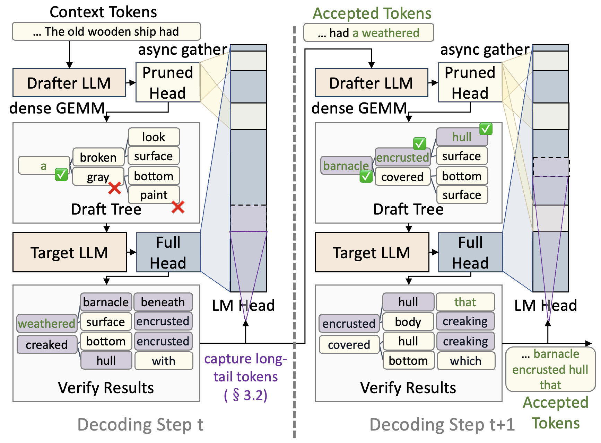

# NanoSpec: Dynamic Minimalist Vocabulary Pruning for Speculative Decoding

<!-- [](<arxiv_link>) [](https://opensource.org/licenses/MIT) -->

## Introduction

The massive vocabulary sizes of large language models (often exceeding 100k tokens) impose a computational bottleneck on the final linear projection layer during speculative decoding. Existing vocabulary pruning solutions rely on static or coarsely-grained sub-vocabularies that necessitate large active sizes (~30k) to maintain draft quality.

**NanoSpec** dynamically constructs a minimalist, context-aware active vocabulary for each generation step. Leveraging the inherent temporal locality of language generation, NanoSpec achieves high coverage while slashing the average vocabulary size by over **40x** (to <3k tokens) without any auxiliary trained parameters. A system-algorithm co-design with **asynchronous gathering** and **GPU-resident state management** overcomes the inefficiencies of sparse memory access on modern hardware.

As a complementary plug-and-play module, NanoSpec cuts draft inference time by an average of **51.6%**, delivering a **1.17-1.29x** end-to-end speedup over EAGLE-2 and EAGLE-3.


<div align="center">
  
</div>


## Installation

Requires: Python 3.11, PyTorch with CUDA support, NVIDIA GPU (Ampere or newer).

```bash
conda create -n nanospec python==3.11 && conda activate nanospec
# Install PyTorch with CUDA support first: https://pytorch.org
git clone --recursive https://github.com/csAugust/NanoSpec.git && cd NanoSpec
```

Edit `setup.py` to set the GPU compute capability (`arch` variable):
- `"80"` for A100
- `"90"` for H100/H20
- See https://developer.nvidia.com/cuda-gpus#compute for your GPU

```bash
pip install .
```

The package compiles custom CUDA kernels (Flash Attention, cuBLAS GEMM wrappers, tree verification, etc.) via pybind11 into `llamacu.C`. This requires a working NVCC toolchain. Compilation takes a few minutes; set `NVCC_THREADS` and `MAX_JOBS` to control parallelism.

After modifying any `.cu` or `.cuh` file, recompile with:

```bash
DEBUG_BUILD=0 python setup.py build_ext --inplace   # fast incremental rebuild
# or: DEBUG_BUILD=1 pip install .                    # full rebuild with debug symbols
```

## Model Weights

NanoSpec requires a base model and an EAGLE-2/3 draft model. To compare with FR-Spec baseline, FR-Spec requires frequency statistics (`freq_*.pt` files) that should be placed in the EAGLE-2/3 draft model directory. Download from HuggingFace:

| Base Model | EAGLE-2 Draft Model | Frequency Statistics |
|------------|---------------------|---------------------|
| [Llama-3.1-8B-Instruct](https://huggingface.co/meta-llama/Llama-3.1-8B-Instruct) | [EAGLE-LLaMA3.1-Instruct-8B](https://huggingface.co/yuhuili/EAGLE-LLaMA3.1-Instruct-8B) | [LLaMA3-Instruct-8B-FR-Spec](https://huggingface.co/thunlp/LLaMA3-Instruct-8B-FR-Spec) |
| [Llama-3.2-1B-Instruct](https://huggingface.co/meta-llama/Llama-3.2-1B-Instruct) | [EAGLE-LLaMA3.2-Instruct-1B](https://huggingface.co/yuhuili/EAGLE-LLaMA3.2-Instruct-1B) | [LLaMA3.2-Instruct-1B-FR-Spec](https://huggingface.co/thunlp/LLaMA3.2-Instruct-1B-FR-Spec) |
| [Qwen2-7B-Instruct](https://huggingface.co/Qwen/Qwen2-7B-Instruct) | [EAGLE-Qwen2-7B-Instruct](https://huggingface.co/yuhuili/EAGLE-Qwen2-7B-Instruct) | [Qwen2-7B-Instruct-FR-Spec](https://huggingface.co/thunlp/Qwen2-7B-Instruct-FR-Spec) |

## Quick Start

```bash
# infer one sample
python examples/example_generate.py

# run evaluations
bash scripts/spec_bench/llama3-8b-instruct/run_baseline.sh
bash scripts/spec_bench/llama3-8b-instruct/run_eagle.sh
bash scripts/spec_bench/llama3-8b-instruct/run_eagle_fr_spec.sh
bash scripts/spec_bench/llama3-8b-instruct/run_eagle_ours.sh
```

For more available scrips, refer to `run.sh`

## Evaluation

All evaluation scripts are in `scripts/<benchmark>/<model>/`. Three benchmarks are supported: `spec_bench`, `human_eval`, `gsm8k`.

### Inference Modes (EAGLE-2)

| Script | Mode | Description |
|--------|------|-------------|
| `run_baseline.sh` | Autoregressive | Standard decoding (no speculation) |
| `run_eagle.sh` | EAGLE-2 | Speculative decoding with full vocabulary |
| `run_eagle_fr_spec.sh` | FR-Spec | Static frequency-ranked vocabulary pruning (`--V 32768`) |
| `run_eagle_ours.sh` | **NanoSpec** | Dynamic context-aware vocabulary pruning (`--mode 2`) |

Set `--mode 1` for **NanoSpec** to evaluate performance without asynchronous gathering (i.e., use indexed GEMM).

### Running Benchmarks

Using Llama-3.1-8B-Instruct on spec_bench as an example:

```bash
# Run inference (each script runs on a separate GPU, check CUDA_VISIBLE_DEVICES inside)
bash scripts/spec_bench/llama3-8b-instruct/run_baseline.sh
bash scripts/spec_bench/llama3-8b-instruct/run_eagle.sh
bash scripts/spec_bench/llama3-8b-instruct/run_eagle_fr_spec.sh
bash scripts/spec_bench/llama3-8b-instruct/run_eagle_ours.sh

# Compare speed across all modes
bash scripts/spec_bench/llama3-8b-instruct/speed_up.sh
```

Replace `spec_bench` with `human_eval`, or `gsm8k` for more benchmarks.

### EAGLE-3 Support

EAGLE-3 draft models are also supported via `run_eagle3*.sh` scripts and `evaluation/inference_eagle3.py`.

**Important note on EAGLE-3 model weights:** The official EAGLE-3 models from [SafeAILab/EAGLE](https://github.com/SafeAILab/EAGLE) are trained on a statically pruned sub-vocabulary (~32k tokens), similar in spirit to FR-Spec. This means their lm_head output dimension is already reduced and the vocabulary is fixed at training time. Applying NanoSpec on top of such models yields limited benefit, because NanoSpec's advantage comes from dynamically constructing a much smaller context-aware vocabulary (< 3k tokens) from the **full** vocabulary space at each step -- a capability that is incompatible with a model whose lm_head was trained on a pre-selected subset.

To fully leverage NanoSpec with EAGLE-3, you need to **train an EAGLE-3 model with the full vocabulary** (`draft_vocab_size == vocab_size`). The `run_eagle3*.sh` scripts are configured for such full-vocab EAGLE-3 models. With a full-vocab model:

```bash
bash scripts/spec_bench/llama3-8b-instruct/run_eagle3.sh          # EAGLE-3 full-vocab baseline
bash scripts/spec_bench/llama3-8b-instruct/run_eagle3_fr_spec.sh   # EAGLE-3 + FR-Spec (--V 32768)
bash scripts/spec_bench/llama3-8b-instruct/run_eagle3_ours.sh      # EAGLE-3 + NanoSpec (--mode 2)
```

### Inference API

```python
import torch
from llamacu.speculative.eagle import LLM_with_eagle

model = LLM_with_eagle(
    base_path="<base_model_path>",
    eagle_path="<eagle_model_path>",
    memory_limit=0.5,
    V=128256,            # full vocab for NanoSpec; 32768 for FR-Spec
    dtype=torch.float16,
    cuda_graph=True,
    max_context_tokens=3072,
)
model.init_storage()

# Load frequency statistics for FR-Spec (skip if using full vocab)
# token_id_remap = torch.load("<eagle_path>/freq_32768.pt")
# model._load("token_id_remap", token_id_remap[:32768].int(), cls="eagle")

model.load_from_hf()

output_ids, accept_lengths, steps, draft_times = model.generate(
    input_ids=input_ids,         # [1, seq_len], int32, on CUDA
    generation_length=1024,
    teminators=[eos_token_id],
    mode=2,                      # 0=FR-Spec, 1=indexed_gemm, 2=NanoSpec
)
```

For EAGLE-3, use `LLM_with_eagle3` from `llamacu.speculative.eagle3` with analogous parameters (replace `eagle_path` with `eagle3_path`).

## Extra Experiments

Additional experiments (ablation study, latency breakdown, VRAM overhead) are in `experiments/`:

```
experiments/
  ablation/       # ablation study scripts and visualization
  latency/        # per-step latency breakdown profiling
  vram/           # VRAM overhead measurement
  visualization/  # comparison plots
```

Results are written to `results/` (gitignored).

## Project Structure

```
llamacu/                   # Python package (installed as llamacu)
  llama.py                 # Base LLM class: model loading, KV-cache, CUDA graphs
  speculative/
    eagle.py               # EAGLE-2 speculative decoding + FR-Spec/NanoSpec modes
    eagle3.py              # EAGLE-3 speculative decoding + FR-Spec/NanoSpec modes
    tree_drafter.py        # Tree-structured draft-verify-accept generation loop

src/                       # CUDA/C++ kernels (compiled into llamacu.C)
  entry.cu                 # pybind11 entry point exposing all kernels to Python
  model/
    eagle.cuh              # EAGLE-2 draft: modes 0 (FR-Spec) / 1 (indexed GEMM) / 2 (async prefetch)
    eagle3.cuh             # EAGLE-3 draft: same 3 modes with capture-layer architecture
    model.cuh              # Base model forward (prefill + decode)
    linear.cuh             # GEMM via cuBLAS with indexed/frequency-ranked/repack variants
    kvcache.cuh            # Position-aware KV-cache management
    tree_drafter.cuh       # Tree verification and KV-cache fixing kernels
    topk.cuh               # GPU top-K selection
  flash_attn/              # Modified Flash Attention v2.4.2 (hdim 64/128, FP16/BF16)
  cutlass/                 # NVIDIA CUTLASS submodule for GEMM templates

evaluation/                # Inference entry points and benchmark loaders
  inference_baseline.py    # Autoregressive baseline
  inference_eagle.py       # EAGLE-2 with --mode and --V flags
  inference_eagle3.py      # EAGLE-3 with --mode, --V, and --freq-path flags
  mt_bench/, gsm8k/, he_local/   # Benchmark-specific evaluation code

scripts/                   # Shell scripts: scripts/<benchmark>/<model>/run_*.sh
experiments/               # Extra experiment code (ablation, latency, VRAM)
fr/                        # Token frequency statistics generation from SlimPajama
```

## Acknowledgment

This implementation is built on [FR-Spec](https://github.com/thunlp/FR-Spec) (ACL 2025).

Draft models from [EAGLE](https://github.com/SafeAILab/EAGLE). Benchmarks from [Spec-Bench](https://github.com/hemingkx/Spec-Bench). Flash Attention kernels from [flash-attention v2.4.2](https://github.com/Dao-AILab/flash-attention/blob/v2.4.2/csrc/flash_attn).


## Citation

```bibtex
@inproceedings{nanospec,
  title={NanoSpec: Accelerating Speculative Decoding with Minimalist In-Context Vocabularies},
  author={Chen, Zhiyang and Xu, Daliang and Zhang, Yinyuan and Wang, Chenghua and Xu, MengWei and Ma, Yun},
  booktitle={Proceedings of the 43 rd International Conference on Machine
Learning},
  year={2026}
}
```
